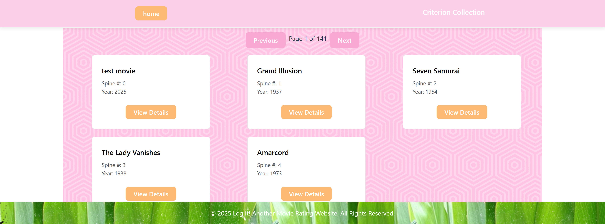

# **Movie Rater DB** 🎬  

A full-stack web application that fetches, stores, and displays movie data from **The Criterion Collection** dataset on Kaggle. This project includes a **Node.js backend** with a **Microsoft SQL Server (SSMS) database** and a **React frontend** built with **Vite**.

---

## Website Screenshots
Below are two screenshots of the site for reference

### Screenshot 1 - Homepage:


### Screenshot 2 - Criterion Films page:


---

## **🚀 Technologies Used**  

### **Frontend (React + Vite)**  
- **React**  
- **Vite**  
- **JavaScript**  
- **Axios** (for API calls)  
- **React Router** (for navigation)
- **Chakra-ui and Tailwindcss** (for styling)

### **Backend (Node.js + Express)**  
- **Node.js**  
- **Express.js**  
- **Microsoft SQL Server (SSMS)**  
- **mssql** (to interact with the database)  
- **Axios** (for fetching Kaggle dataset)  
- **fs** (for handling file operations)  

---

## **🎥 Kaggle Dataset**  

This project fetches movie data from the **Criterion Collection** dataset on Kaggle:  
📂 **Dataset:** [The Criterion Collection on Kaggle](https://www.kaggle.com/datasets/blondedman/the-criterion-collection)  

---

## **🛠️ Setup Instructions for running project locally**  

### **1️⃣ Clone the Repository**  
```bash
git clone https://github.com/Becca-Guertin/movieRater.git
```

### **2️⃣ Install Backend Dependencies**  
Navigate to the backend folder and install the necessary dependencies:  
```bash
cd movieRater-db-backend  
npm install  
```

### **3️⃣ Install Frontend Dependencies**  
Navigate to the frontend folder and install the necessary dependencies:  
```bash
cd movieRater-frontend  
npm install  
```
### **Set Up Environment Variables**  
Create a `.env` file inside the `backend` folder and add the following environment variables:  
```env
PORT=5000  
DATABASE_URL=your-database-connection-string  
```
- TODO: include section here for how to get Authentication - API token from Kaggle 
- TODO: include section here for setting up your database 
- TODO: include the API key and Database info into the .env file 
### **Start Backend Server**
```bash
cd movieRater-db-backend
node server.js
```
### **Start the Frontend**
```
npm start 
```

### **Features**
- **Fetch movie data** from Kaggle via API  
- **Store movie data** in SQL Server database  
- **Display movies** in a React frontend with dynamic cards  
- **View movie details** on a separate page  
- **RESTful API** for backend operations

## **API Endpoints**  
| Method | Endpoint                | Description                           |  
|--------|-------------------------|---------------------------------------|  
| GET    | /api/movies             | Get all movies                        |  
| GET    | /api/movies/:id         | Get a single movie by ID              |  
| GET    | /fetch-and-download     | Fetch and download the Kaggle dataset |  
| POST   | /api/parse-and-insert   | Insert movie data into the database   |  

## **Future Improvements**  
- Implement search and filter functionality for movies by year, country, etc.  
- Add user authentication to allow users to rate or review movies  
- Improve UI/UX design for better user experience  
- ``Enable pagination for displaying large numbers of movies`` COMPLETED ✅  


## **License**
This project is license under the MIT License